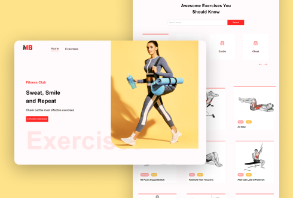
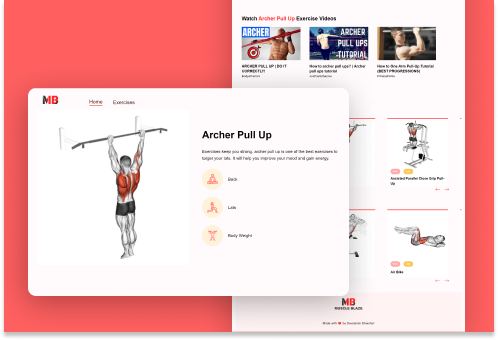

# Muscle Blaze- Exercise Website

Muscle Blaze is a one-stop website for searching various exercises related to various body parts. Make the searches related to specific body part or specific equipment and find the exercises with practical demonstration (Gifs and Youtube Videos).

Done with a specific exercise and want to know more similar exercises? No problem, scroll down that exercise to find more related exercises.

If unable to understand the exercises through gifs, get the Youtube Videos explaining those exercises.

## Technical Features

Some of the technical features are

* Horizontal Scrolling Components for displaying body parts and similar exercises in a single row.
* Implemented Pagination to display various exercises over different pages and not cluttering a single page.
* Fetching data of exercises and videos from APIs.
* Making the website Mobile Responsive.

## Tech Stack

The Website is built using

* React and its Libraries such as React-router-dom, React-horizontal-scrolling-menu, React-loader-spinner, etc.
* Material UI for creating beautiful looking User Interface.
* APIs from Rapid API to fetch the exercise data and the videos data.

## Results

   

 
